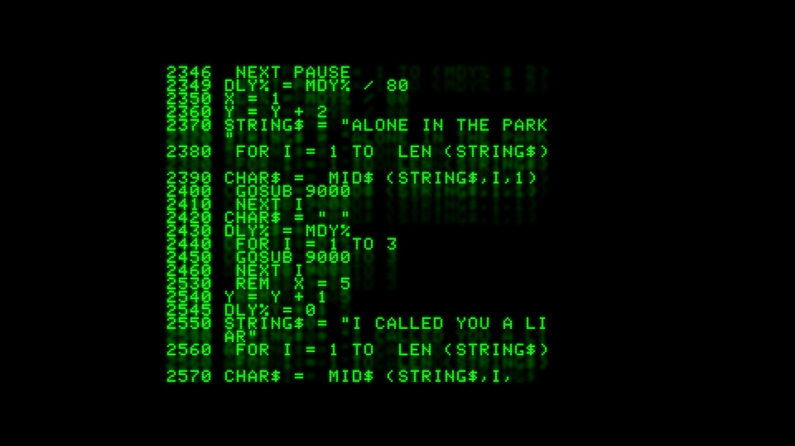

***Markdown*** - это язык размещения, который позволяет формировать текст.

Чтобы сделать заголовок, для этого нужно в начале слова добавить знак решетку "#":

# Заголовок

Чтобы сделать курсивное начертание нужно поставить в начале и конце слова знак "*":
*джоджо*

Поставив две звездочки в начале и конце слова, то шрифт этого слова будет жирныйм:
**6666**

Поставив в начале и конце три звездочки, то шрифт изменится на полужирное курсивное начертание:
***миумиу***

Если поставить два знака "~" перед и в конце слова, то это слово зачеркнется:
~~мумия~~

Поставив в начале одну звездочку и нажав на пробел, то можно вызвать ненумерованные списки:

* лоллолол
* lol
* up
* kek

А если поставить цифры 1,2,3... перед словами, то можно вызвать нумерованные списки:

1 FBI open up

# Основные команды Git.

1 **Git init** указывает папку, в которой git начнет отслеживать изменения;

2 **Git status** показывает текущее состояние;

3 **Git add** добавляет файл к следующему коммиту;

4 **Git commit -m** создает коммит;

5 **Git log** открывает журнал изменений;

6 **Git checkout** позволяет переключаться от одного коммита к другому;

7 **Git diff** позволяет показать разницу между текущими файлами и сохраненными.

lkjhyuyuyuyg
4556552

Hi!
4556552 354153431

jo

U.N. Owen was when?
Invizible007
+6598++554548673